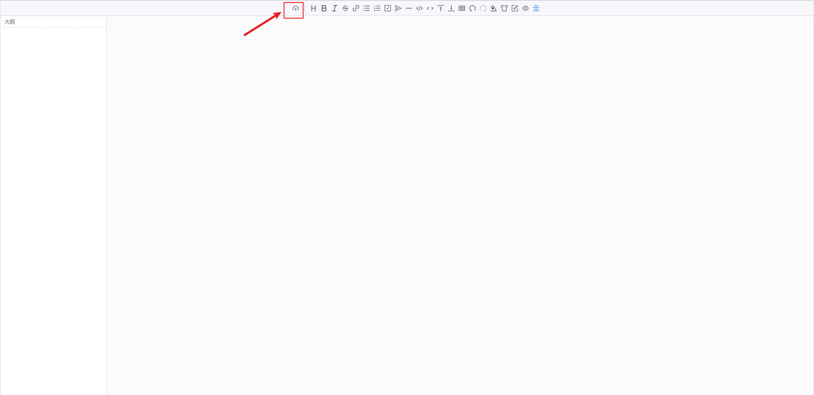
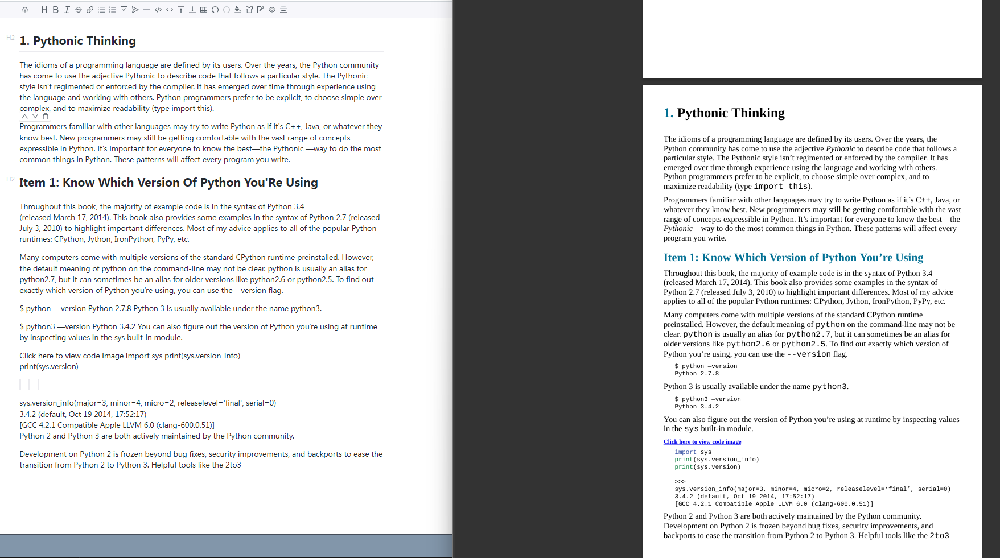

# marker-deploy

## 简介
一个简易的pdf转markdown服务
- 前端项目地址：[marker-ui](https://github.com/zivenyang/marker-ui)
- 后端项目地址：[marker-api](https://github.com/zivenyang/marker-api.git)

## 特性
- 基于[marker](https://github.com/VikParuchuri/marker.git)的PDF转Markdown服务，支持OCR识别
- 基于[Vditor](https://b3log.org/vditor/)的markdown编辑器
- 基于docker部署

## 部署
在运行安装命令之前，请确保您的机器上安装了 [Docker](https://docs.docker.com/get-docker/) 和 [Docker Compose](https://docs.docker.com/compose/install/)

```bash
git clone https://github.com/zivenyang/marker-deploy.git --recursive
cd marker-deploy
docker-compose up -d --build
```

前端日志查看：`docker logs -f marker-ui`  
后端日志查看：`docker logs -f marker-api`

## 使用
访问[http://localhost:28000/](http://localhost:28000/)进行访问

点击第一个图标上传pdf文件进行识别，识别时长取决与本机算力，第一次使用会从huggingface上下载模型，本镜像默认使用的cpu计算，识别时间较长（约10分钟），如需使用gpu请修改docker-compose.yml中的api服务，参考[Turn on GPU access with Docker Compose](https://docs.docker.com/compose/gpu-support/)


中文识别需要将在`marker-deploy/marker-api/server.py`中将默认语言改为`Chinese`以提高中文识别准确率，修改后记得返回`marker-deploy`目录使用`docker-compose up -d --build`重新构建服务
```python
@app.post("/convert")
async def convert_pdf_to_markdown(pdf_file: UploadFile = File(...), extract_images: bool = True):
    Settings.DEFAULT_LANG="Chinese" # 将默认语言设置为中文
    if extract_images == False:
        Settings.EXTRACT_IMAGES = False
        print("Print EXTRACT_IMAGES set to False")
    else:
        Settings.EXTRACT_IMAGES = True
...
```

## 效果


## 不足
- 暂不支持图片预览，但接口有返回base64编码

## 依赖
- [marker](https://github.com/VikParuchuri/marker.git)
- [marker-api](https://github.com/adithya-s-k/marker-api)
- [Vditor](https://b3log.org/vditor/)